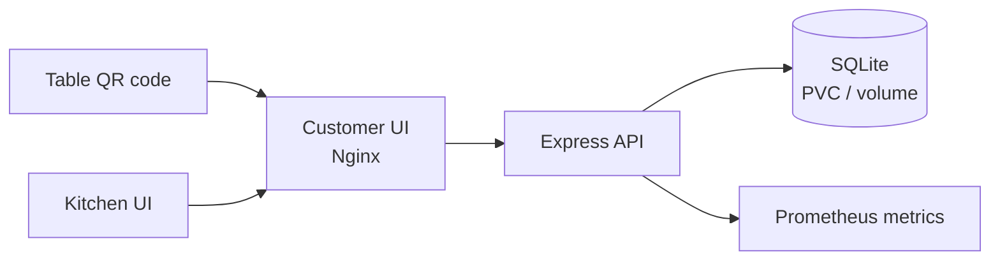

# TableBite architecture

The customer browser calls the API through nginx. The kitchen dashboard uses the same API and sends the `x-admin-key` header for status changes. SQLite is deliberately kept at one backend replica with a `Recreate` deployment strategy; the stateless frontend can roll out with two replicas.
